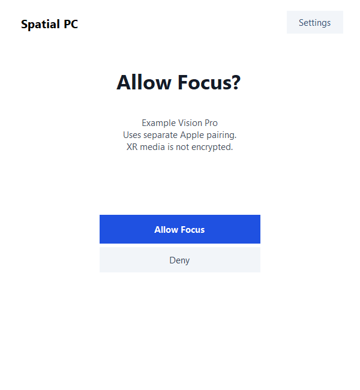

# Isolated Focus control implementation

The optional Windows control listener uses existing paired-device TLS identity to
request a local Focus grant, prepare the existing Apple-local development scene,
and cancel it. It is disabled by default. Both `--xr-development` and
`--focus-control-development` are required. This change has not replaced a live
host, opened a firewall rule, started CloudXR, or captured a desktop.

## Interface and trust

- TCP47994, TLS1.3 with enrolled client certificates, ALPN `spatialpc-control/1`.
  Existing SPP2 enrollment and desktop framing remain unchanged.
- Four-byte big-endian JSON records, exact schema, consecutive request IDs,
  bounded readers/writers and no session resumption. See [contract](focus-control-v1.md).
- The saved server identity is reused; a per-device `allowFocusControl` grant is
  persisted only after explicit Windows approval. Existing and newly paired
  devices default to no grant. The current implementation presents the grant as
  a separate step; it does not silently expand desktop pairing consent.
- Apple local TCP55000 and system QR remain separate trust. Matching the Apple
  source address to the control peer is a routing restriction, not a
  cryptographic association with Apple ClientID. XR media is development-only
  and unencrypted; consumer readiness and trust persistence remain false/unverified.
- Mac resolves saved Bonjour service addresses without opening desktop TLS,
  then dials fixed47994. Windows publishes no additional Bonjour service.
  Returned IPv6 addresses omit the Windows-local zone; Mac applies its own scope.
- No installer/firewall update for47994 is included. An independently reviewed,
  scoped network setup and matching Mac implementation are required before a
  coordinated live test. The existing ready development host stays unchanged.

## Ownership and cancellation

The same media owner excludes simultaneous desktop and Focus media. Prepare
waits at most eight seconds for this device's desktop cleanup, then claims Focus
atomically and pauses desktop listening. It never forces another desktop owner
off. Local55000 readiness is not runtime, headset-frame, or setup-success evidence.

The control reader remains active through permission and lifecycle waits. Stop,
EOF, disable, revoke, expiry and interface loss invalidate the generation before
cleanup. Queued endpoint success becomes a canceled terminal response; stale
progress cannot reopen a stopped wizard QR. Only the exact backend-authorized
generation can present a remote-start QR. Apple also keeps its continuous reader
through native prepare, QR receipt, and media start.

Confirmed cleanup restores previously allowed desktop listening, regardless of
`returnToDesktop`. Local disable, interface loss and uncertain cleanup suppress
restoration. No capture or client reconnection is triggered by restoration.
Cleanup uncertainty poisons media ownership. An old session's repeated Stop
cannot cancel a newer session.

## Validation

Windows validation: 97 Python tests run, 96 passed and one pre-existing native
fixture test skipped because that optional fixture binary is absent from this
isolated checkout. Release UI compilation passed. Offscreen wizard fixtures:
68 assertions passed. No GPU/native-runtime fixture was rebuilt or run.

The focused Python suite covers control framing/IDs, real ephemeral loopback
TLS, enrolled/missing/revoked certificates, ALPN, two-connection admission,
permission approval/denial/cancellation/expiry, bounded attempts, heartbeat and
setup deadlines, immediate cancellation during suspended work, queued response
invalidation, desktop-owner races, and restoration/failure behavior. Existing
Focus lifecycle and Apple protocol fixtures are included. Disposable Windows
DPAPI tests verify explicit grant persistence without changing host identity.

Run from repository root with the packaged Python environment:

```text
python -I -B -W error::RuntimeWarning -c "import sys,unittest;sys.path.insert(0,'tests');sys.path.insert(0,'windows/host');r=unittest.TextTestRunner().run(unittest.defaultTestLoader.loadTestsFromNames(['test_focus_control','test_focus_control_tls','test_focus_host','test_focus_local','test_product_identity']));sys.exit(not r.wasSuccessful())"
cmd /c windows\ui\build.cmd
cmd /c tests\build-wizard-fixtures.cmd
```

The UI fixture needs the existing verified QRCoder dependency beside its binary.
It renders passive controls offscreen using public names, code1234 and fake QR
content. It never shows a window, launches the backend, injects input or reads
the screen. Focus permission, cancellation, exact QR generation and stale-event
checks are included alongside the existing wizard fixtures.



No cross-machine client interoperability, physical Focus, runtime performance,
installer upgrade, new native binary, or media-security validation is claimed.
