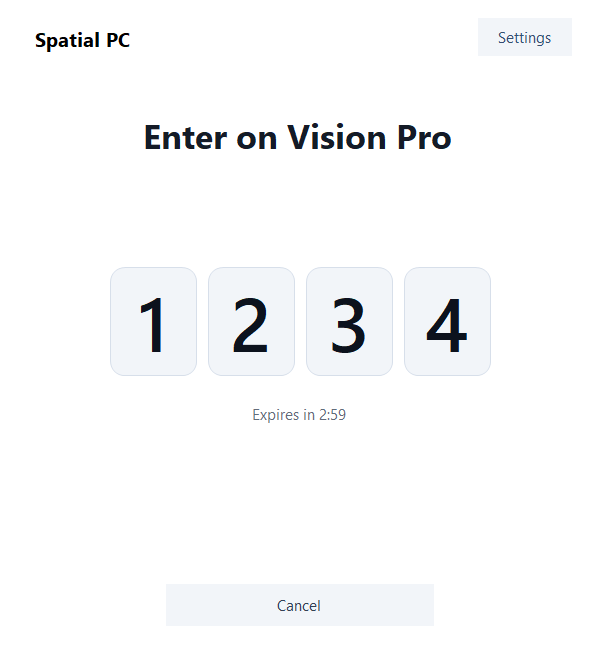
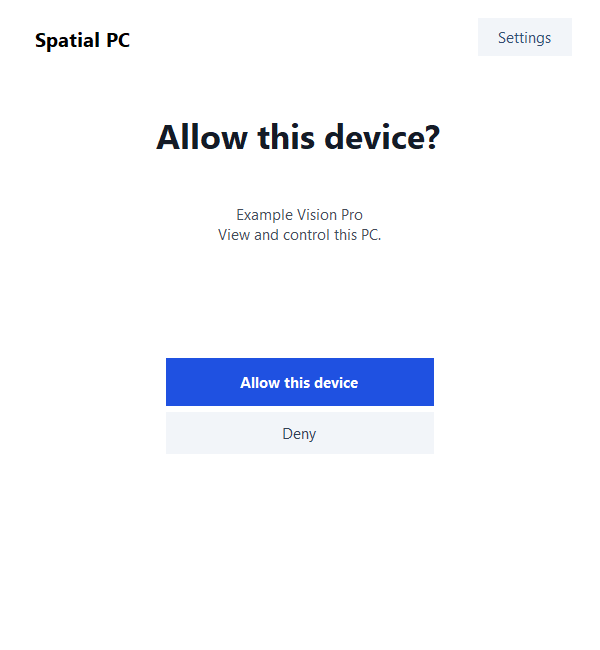
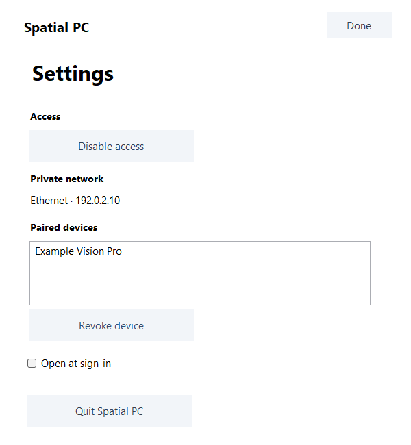
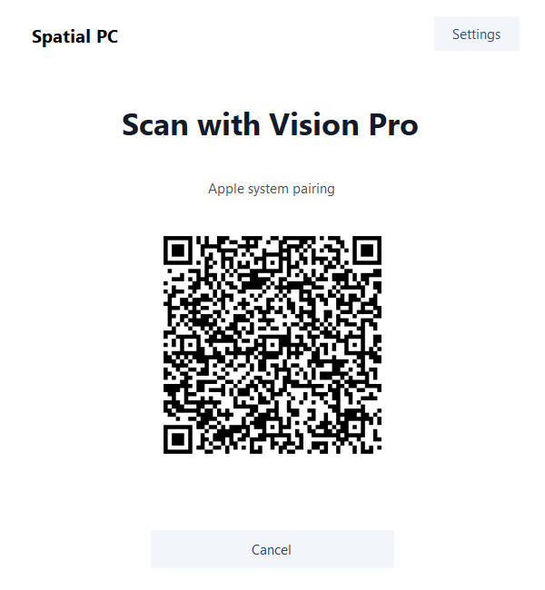

# Windows setup wizard

Windows now shows one stage at a time: network setup, access permission, pairing code, device approval, then ready. Four large read-only digit boxes match the AVP input layout. Each stage has at most one primary action; Cancel and Deny remain explicit secondary actions.

Shared labels with the AVP wizard: **Pair a new device**, **Allow this device**. Approval still names the exact pending device and states **View and control this PC**. Windows success uses **Device added / Done**; the AVP owns **PC added / Connect**.

Settings contains access, Private network, paired devices/revoke, sign-in preference and Quit. Consumer settings contain no encoder, runtime, port or build controls. Existing development flags retain their gated Focus/encoder controls in Settings. An actual Apple QR request replaces the current stage in the same window, with Cancel. This does not implement the proposed remote Focus orchestration or claim persistent Apple trust.

Backend, native binaries, SPP2, identity, leases, firewall policy and stream protocol are unchanged. The UI keeps the exact pending approval ID; double approval cannot emit a second Allow. Cancel/expiry clears sensitive content and waits for pairingClosed before a new attempt. Late code/approval events after cancellation are ignored. Closing the window cancels an active pairing/QR stage; ordinary connected use still minimizes to the tray. Local disable and Quit remain available there.

## Validation

- Production UI build: `windows\ui\build.cmd`.
- Fixture build: `tests\build-wizard-fixtures.cmd`; fixture entry points exist only with `UI_FIXTURE` and are not compiled into the product build.
- Fixture execution: `.local\wizard-fixtures\WizardFixtures.exe .local\wizard-fixtures\evidence` with the already-reviewed QRCoder 1.6.0 DLL beside the fixture executable. `FocusQr` verifies its existing SHA256 before loading it.
- 60 assertions passed across actual UI event handling and passive view layout. Covers approval consent/ID/single use/expiry, cancellation and late approval, expiry/reopen ordering, success after pairingClosed/status, error visibility, sensitive-content clearing, stale QR generation events, canceled QR admission and fresh-generation reentry, modal revoke selection changes/disappearance, leading zeros, and absence of development controls in consumer settings.
- `DrawToBitmap` generated 13 fixture views without showing or activating a window. No backend, identity store, registry preference, network listener, screen capture, mouse/keyboard automation or native media process is used by the fixture path.
- Visual review covered code, consent, Settings, Apple QR, recovery and long names. Primary buttons are 268×48 logical pixels; text and bounds scale with DPI. The 150% images are deliberate enlarged-layout/font fixtures, not proof of a physical monitor DPI transition.

All pictured data is public fixture data: `1234`, `Example Vision Pro`, documentation address `192.0.2.10`, and a QR payload explicitly labeled `PUBLIC-FIXTURE-NOT-A-CREDENTIAL`. That QR cannot enroll a device. No real pairing code, QR credential or screenshot of Peter's desktop is included. The display-only digit boxes use GolfCore CodeInput's separate rounded boxes, neutral borders and equal spacing, enlarged for Windows; no input glow is shown.

This is isolated source/UI validation. It does not replace the ready host or establish new physical pairing, input, streaming or XR success. Live review and a separately coordinated installation remain outstanding.
